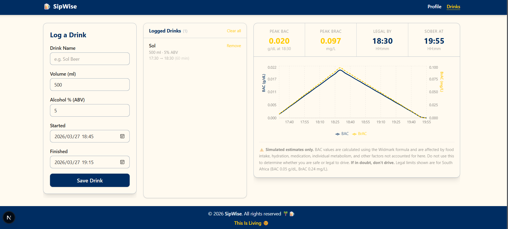

# SipWise

A blood alcohol content (BAC) simulator built for responsible drinking. Log your drinks, track your BAC and BrAC curves over time, and know when you'll be legal to drive — before you get behind the wheel.

> **Disclaimer:** All values are simulated estimates based on the Widmark formula. Individual results vary with food intake, hydration, medication, and metabolism. Never use this app to decide whether you are safe or legal to drive. **If in doubt, don't drive.**
>
> Legal limits shown are for **South Africa** — BAC 0.05 g/dL, BrAC 0.24 mg/L.

---



---

## Features

- **Drink logging** — Log drinks with a name, volume, ABV, and actual start/finish times. Backdating is supported, so you can log a drink you already finished.
- **BAC simulation** — Widmark formula with sex- and age-adjusted metabolism rates. Uses an incremental ethanol pool model so multi-drink sessions are calculated correctly.
- **BrAC calculation** — Breath alcohol concentration derived from BAC using the 2100:1 breath-blood partition ratio.
- **Live chart** — Dual-axis line chart (BAC left, BrAC right) with legal limit reference lines, peak stats, legal-by time, and sober-at time.
- **Sponsor theming** — CSS variable-driven theme system. Switch between Default, Heineken, Corona, and Black Label in one line of config.
- **Responsive layout** — Three-column viewport layout on desktop (form | drink list | chart). Single-column stack on mobile. No page scrolling required on desktop.
- **Persistent state** — Profile and drink session stored in `localStorage`. Survives page refresh.

---

## Privacy

**No data ever leaves your device.** Your profile (age, sex, weight) and drink session are stored exclusively in your browser's `localStorage`. There is no backend, no database, no analytics, and no network requests made by the app itself. Clearing your browser data will erase everything.

---

## Tech Stack

| | |
|---|---|
| Framework | Next.js 15 (App Router, Turbopack) |
| Language | TypeScript |
| Styling | Tailwind CSS v4 + CSS custom properties |
| Charts | Recharts |
| Date handling | date-fns |
| State | React `useState` / `localStorage` |

---

## Prerequisites

- **Node.js ≥ 18.18** (required by Next.js 15)
- npm, yarn, or pnpm

---

## Getting Started

```bash
npm install
npm run dev
```

Open [http://localhost:3000](http://localhost:3000).

On first load you'll be redirected to `/profile` to enter your age, sex, and weight. After saving, you're taken to `/drinks` where you can start logging.

---

## Deployment

The easiest option is [Vercel](https://vercel.com) — import the repo and it deploys automatically with zero config.

For self-hosting, build a production bundle and run it with Node:

```bash
npm run build
npm start
```

Because the app has no backend or environment variables, any static or Node-capable host works (Vercel, Netlify, Railway, a plain VPS, etc.).

---

## Project Structure

```
app/
  page.tsx              # Redirects to /profile or /drinks based on stored profile
  profile/              # Profile setup page
  drinks/               # Main drink logging + simulation page
  settings/             # Theme settings
  globals.css           # Tailwind @theme inline tokens + [data-theme] overrides

components/
  DrinkForm.tsx         # Three-column layout: form, drink list, BAC chart
  BACChart.tsx          # Recharts dual-axis chart with stats row + disclaimer
  ProfileForm.tsx       # Age / sex / weight form
  ThemeProvider.tsx     # Context + data-theme attribute provider
  layout/               # Header, Footer, Layout wrapper

lib/
  bac/
    index.ts            # simulateSessionBAC — Widmark simulation loop
    metabolism.ts       # Age/sex-adjusted elimination rate (β)
  conversions.ts        # mlToGramsEthanol, bacToBrac, bracToBac
  constants.ts          # Widmark ratios, legal limits, ethanol density
  storage.ts            # localStorage helpers (typed get/set/append/remove)
  storageKeys.ts        # Centralised localStorage key names

config/
  theme.ts              # ACTIVE_THEME — change this to switch sponsor theme
```

---

## BAC Model

The simulation uses the **Widmark formula** with incremental metabolism:

```
BAC (g/dL) = ethanolPool (g) × 100 / bodyWater (g)

bodyWater   = weightKg × r × 1000          (r = Widmark distribution factor)
r           = 0.68 male | 0.55 female | 0.62 other

eliminationPerStep = β × (stepMinutes / 60) × (bodyWater / 100)
  β (g/dL/hr)  = 0.013–0.017  (adjusted for age and sex)

BrAC (mg/L) = BAC × 10000 / 2100           (2100:1 breath-blood ratio)
```

Each 5-minute step absorbs ethanol linearly over the drink's duration, then subtracts the step's elimination from the running pool. This ensures drinks consumed later in a session are not over-metabolised.

### Known model limitations

The simulation is a reasonable approximation but intentionally simplified. Factors **not** accounted for:

- **Food** — eating significantly slows absorption by delaying gastric emptying. The model assumes a fasted or lightly-fed state.
- **Carbonation** — sparkling drinks (champagne, beer) are absorbed faster than still drinks at the same ABV.
- **Absorption variability** — the model distributes absorption uniformly over the drink's duration. Real absorption follows a curve influenced by stomach contents and drink concentration.
- **Individual tolerance** — chronic drinkers metabolise alcohol faster; the β values used are population averages.
- **Medications and health conditions** — many drugs interact with alcohol metabolism and are not modelled.
- **Breath-blood ratio variance** — the 2100:1 ratio is a legal standard. The physiological ratio varies between individuals and some evidential breath instruments use 2300:1.

---

## Theming

Active theme is set in `config/theme.ts`:

```ts
export const ACTIVE_THEME = "corona"; // "default" | "heineken" | "corona" | "blacklabel"
```

Themes are defined as CSS custom property overrides in `app/globals.css` and applied via the `data-theme` attribute on the root element. Tailwind utility classes (`bg-primary`, `text-secondary`, etc.) resolve through `@theme inline` tokens.

---

## References

- Widmark, E.M.P. (1932). *Die theoretischen Grundlagen und die praktische Verwendbarkeit der gerichtlich-medizinischen Alkoholbestimmung.* Urban & Schwarzenberg.
- Dubowski, K.M. (1985). Absorption, distribution and elimination of alcohol: highway safety aspects. *Journal of Studies on Alcohol*, Supplement 10.
- National Road Traffic Act 93 of 1996 (South Africa) — prescribed legal limits.

---

## Legal

This project is for educational and harm-reduction purposes only. It does not constitute medical or legal advice.
